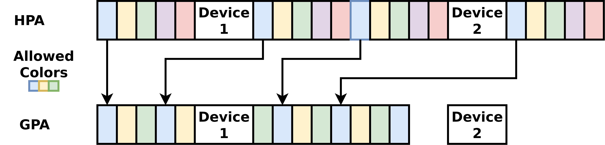

# Project: Coloring Tyche

Report for the summer internship of Luca Wilke, which was about implementing the ideas
of the Magheira paper in Tyche.

[Initial Plan](https://microsofteur.sharepoint.com/:w:/t/Venice659/Ecsi8WFry_lCgPM112ZFjVUBCNVCcMK_x3s16p8R4NLj-A?e=S1L9ZS&wdOrigin=TEAMS-MAGLEV.p2p_ns.rwc&wdExp=TEAMS-TREATMENT&wdhostclicktime=1724743232182&web=1)

During my internship I implemented support for coloring dom0 and new TDs. I also did some initial work for coloring the Tyche monitor itself. As documented at the [end of this document](#open-issues) there are a few issues and bugs with the current implementation.

## Coloring dom0

In order to color dom0, I changed 3 components: the first-stage "Tyche loader", the Tyche monitor, and the IOMMU driver in dom0.

Coloring dom0 is only enabled if the feature flag `color-dom0` in `monitor/first-stage/Cargo.toml` is used.
Instead of hiding all changes required for coloring behind a feature flag, the idea is to restrict the conditional compilation to the Tyche loader, more specifically to the areas where we create the low level memory allocators. Afterwards, there are only a few areas which will need low level information about memory, which mostly boils down to "single range of physically contiguous memory" vs "list of multiple physically contiguous ranges". We introduce if/else switches at these locations to handle the subtle differences.

### CD0: Tyche Loader

The "Tyche loader" does the initial memory partitioning by creating dedicated allocators for itself, Tyche and dom0.
I changed the creation of the allocators to use a coloring allocator for dom0. To this end, I had to slightly change the `RangeAllocator` trait. Instead of returning a single, physically contiguous range, it now has the ability to return multiple physical ranges, to accommodate the behavior of coloring allocators.
At several places we need to pass around chunks of physical memory using a succinct representation. Thus, I introduced a wrapper enum which introduces the concept of a ColorRange alongside the existing PhysicalRanges. A ColorRange represents all memory with the color in range [a;b] given the current memory map and the memory coloring function.

Eventually the dom0 allocator is used to load the vmlinux binary of the Linux kernel running in dom0. I had to change large parts of the ELF loader, since it made heavy assumption on physical contiguous memory. Since we don't build the EPTs yet, we need to pay special attention that the logic for loading vmlinux matches the GPA space that we construct later on.

Finally, I added a few fields to the Manifest that is passed from the Tyche loader to Tyche to inform it about the memory layout.
This is necessary because Tyche now needs to know which colors are used for dom0 and which memory locations refer to devices.

### Implementation details

Changes to `RangeAllocator` trait: `crates\mmu\src\frame_allocator.rs`.

The main changes regarding the allocators are in `monitor\first-stage\src\mmu\frames.rs`.

- The `PartitionedMemoryMap` describes the memory layout in a flexible manner that allows to hide most differences of "physically contiguous memory" vs "scattered memory".
- The `ColoringRangeFrameAllocator` is the pendant to the regular frame allocator but allows to restrict the color of the returned memory.
- The `create_guest_allocator` and `create_stage2_allocator` use conditional compilation to create a coloring allocator if coloring is enabled. Coloring for stage2/Tyche is still work in progress. So far, we can load the elf to colored memory and also build correct page tables. However, the Tyche code itself often does not use the page tables to perform VA to PA translation but instead assumes that there is a fixed offset between the two.

The changes for loading ELF binaries to scattered memory are implemented in `monitor/first-stage/src/elf/relocate.rs` and `monitor/first-stage/src/elf/mod.rs`

- The `relocate_elf` function allocates the memory for the ELF binary. Previously it directly operated on physical memory, bypassing any allocators. With coloring, we have to use the allocator abstraction to support both booting with and without coloring. In addition, we have to make sure that the addresses that we use for loading match the layout of the GPA space that we create later on, when building the EPTs. Since we use the compactified mapping strategy (see next section), we know that the first allocated frame will be mapped to GPA 0x1_000, the second to 0x2_000 and so on. Thus, "seek forward" the allocator until we reach the correct "GPA". The struct for each elf segment now directly stores the memory to which it should get loaded
- In `mod.rs` the main changes are about creating page table mappings. For phys contig. vs. scattered we basically only need a wrapper, that calls the mapping function on each contig. range. The biggest change is to support creating the initial page tables used by dom0. For these, we have to make sure that we already use GPAs for the addresses that we write into the page table data structure, but we also need to be able to translate them to HPAs while traversing the page tables. This is implemented in `GuestPtMapper` in `crates/mmu/src/guest_ptmapper.rs`. I struggled with hiding all of this in a traits+type parameters and thus introduced an explicit switch-case enum `ELfTargetEnvironment` to differentiate the two mapping targets.

The changes on the interface between stage1 and Tyche are in `monitor\first-stage\src\second_stage.rs`.
I created a redefinition of the memory region struct, to avoid pulling additional dependencies into Tyche,
thus we have to do the awkward type conversion of the memory region types (`manifest_s2_mem_regions`).

### CD0: Tyche Monitor

For the Tyche monitor there are two major areas that we need to change to support coloring dom0: capabilities and EPT building.

For the capabilities I introduce two "resource kinds": "Device memory" and RAM. Device memory cannot be colored and will get some special handling during the EPT building.
For RAM memory, colors are added as an "additional dimension" similar to read/write/execute access rights. One side effect of this is that
capabilities don't necessarily refer to physical contiguous memory anymore.
We do not enforce color exclusivity in the capability engine but delegate this to the attestation report. The report will enable the verifier to
infer whether they have exclusive access to a color.

For building the EPT tables, we start by parsing the manifest from the Tyche loader, to figure out which colors dom0 does have access to. Next, we create the corresponding capabilities. Similarly, we
create capabilities for all devices. This is done by creating capabilities for the "gaps" in the boot memory map that we obtained from the Tyche loader. This is the area where devices are located.
The exact address information is passed to dom0 via the ACPI tables, for which we create an identity mapping.
For the IOMMU we restrict the access rights of dom0 to read only (eventually, we could completely unmap the IOMMU, c.f. [here](#cd0-dom0))

Next, we change the way that the EPTs are constructed.
For this, we build on the existing "remapper" concept which allows
to specify the GPAs where a given HPA should be mapped in the EPTs.
With coloring, we require a very large number of remappings. Since Tyche does not use dynamic memory allocation it manages remappings in a compile-time allocated array. Increasing this to accommodate the new requirements led to several compiler errors.
Thus, we opted to add an abstraction that allows to store the remappings for the base memory of dom0 (or a new TD) in a more compact manner, which we call "compactified mappings".
Compactified mappings, store a snapshot of the capabilities as well as a bitmap with the accessible colors. Based on this, we recompute the mappings on the fly, whenever we need them
The following picture shows the basic idea for compactified mappings

First, devices are identity mapped. Next, the remaining free parts of the GPA space are "filled" with the memory that dom0 has access to.

In the [open issues](#ept-iommu-page-table-updates-are-slow) we discuss some remaining issues with the strategy as well as potential solutions.

To enable DMA accesses, we use the DMA-Remapping feature of the IOMMU. For security reasons, this is programmed directly in Tyche. The IOMMU is not mapped as writable to dom0. To avoid
requiring any device specific logic, we simply mirror the EPT page tables in the DMA-Remapping page tables.

It turned out that the Interrupt Remapping feature of the IOMMU has an interface that requires passing HPAs to the IOMMU. Without interrupt remapping, we cannot use the APIC in x2APIC mode, which would e.g. limit the number of useable cores. In addition, Interrupt Remapping is an important feature if we want to tackle interrupt security in a future version of Tyche.

As dom0 only knows GPAs, we cannot directly use the interface for Interrupt Remapping.
Even worse, the Queued Invalidation feature, which is required by the Linux driver for Interrupt Remapping, has a mechanism that would allow arbitrary memory writes if we would allow dom0 direct access. Both Interrupt Remapping and Queued Invalidation are features of the IOMMU itself and thus do not use DMA remapping, as it does not apply to the interface of the IOMMU itself, but only to "regular" devices.
Thus, we need to use a paravirtualized driver in dom0, that accesses these features of the IOMMU via Tyche calls.
Using this mechanism, we do the GPA<->HPA translation on the fly in Tyche.

#### Implementation Details

To represent colored RAM memory and Device memory, I added a `ResourceKind` field to the `AccessRights` struct in `crates\capability-engine\src\region.rs`. For RAM memory it contains a bitmap with the allowed colors. Storing the memory coloring object directly would have lead to a huge spread of type parameters. Since the memory coloring functions are inherently state less, I used a typedef `ActiveMemoryColoring` to access the selected memory coloring function. The downside of this approach is that testing capability related functionality with custom coloring functions sometimes requires some awkward type conversions.

In the `do_init` function of the `Monitor` in `monitor/tyche/src/monitor.rs` we parse the memory map as well as the information which colors should be used for dom0 from the manifest that was passed to use by the previous stage.
Based on this, we create a root region (type RAM) for each physical contiguous memory region in the memory map and grant dom0 the access rights to its colors.
Afterwards, we create the memory region for devices, which are located in the gaps between the memory regions in the memory map.
Finally, we use `map_compactified_range` to prepare for building the EPTs. This will store a snapshot of the currently granted accessible regions. As a result, we would need to completely remove the remapping and re-add it, if we wanted to revoke access rights. However, removing the "core" memory of dom0 is not an intended use case.

The logic for the remapper is implemented in `crates/capability-engine/src/remapper.rs`.
We have two kinds of remappings, simple remappings and compactified remappings.
For compactified mappings, the main logic is implemented in `CompatifiedMappingIter` in `crates\capability-engine\src\remapper\kmerge_iter.rs`

To compute the remappings, in `new_merged_remap_iter` we take an iterator of all memory regions that are currently accessible to us and a list of all the simple remappings and `CompactifiedMappingIter`.
Based on this, we create a `MergedRemapIter`. Internally, this fill first fuse all the simple remappings and compactified remappings into a single "stream" of all remappings. Then this stream is "matched" against the "stream" of memory regions currently accessible to us.

The actual EPT rebuilding happens in `update_ept_pages@monitor/tyche/src/x86_64/state.rs`.

Mirroring the EPT page tables to the IOMMU is done in `update_iommu_page_tables@monitor/tyche/src/x86_64/state.rs`.
Currently, we lack a good understanding which kind of synchronization is required to remove a mapping from the IOMMU PTs.
Thus, we only create them once (and also don't include the memory from the pool reserved for new TDs, c.f. [Coloring new TDs](#coloring-new-tds), which will not be used for DMA anyway).
The core issue with synchronization is, that we don't know if an address is used for DMA. Thus, we don't know if we would remove the mapping for an address that is still in use. Usually the IOMMU is programmed by the device driver, which avoids this issue.

The main logic for the paravirtualized IOMMU is implemented in `monitor\tyche\src\x86_64\paravirt_iommu.rs`.

### CD0: dom0

As motivated in the section for the Tyche monitor,
we have to change the Interrupt Remapping and Queued Invalidation drivers of dom0 to use a paravirtualized approach, that uses Tyche calls
to interface with the IOMMU. The IOMMU device itself is still advertised to dom0 via ACPI, but we restrict dom0's memory access rights to it.
(Right now, dom0 still has read access, we could potentially completely unmap the IOMMU)

#### Implementation details

In Linux, the interrupt remapping driver is implemented in `drivers/iommu/intel/dmar.c` and the queued invalidation driver is implemented in `drivers/iommu/intel/q_inval_pv.c`.

For all interactions with the IOMMUs memory mapped registers, we simply add a `ifdef` to switch the memory access operation with a Tyche call to the paravirtualized IOMMU driver. This at the top of the two previously mentioned files.

For the interrupt remapping table, the IOMMU only stores an HPA and its size. As we cannot guarantee that we have contiguous memory, we need to restrict the amount of memory that the Linux driver allocates for the remapping table to one page (`linux/drivers/iommu/intel/iommu.h:L539`).

For the Queued Invalidation driver in `drivers/iommu/intel/q_inval_pv.c`, we have to do additional work. With Queued Invalidation, the driver submits so-called descriptors be writing to a driver allocated buffer, whose address is communicated to the IOMMU.
The wait descriptor contains a write-back address to which the IOMMU will write a caller defined value. Thus, we have to move the managed of the buffer to Tyche and replace the memcpy operations with corresponding functions. This is implemented in
`drivers/iommu/intel/q_inval_pv.c`

## Coloring new TDs

We need a dedicated memory pool that contains whole colors. The pool is managed by a dedicated allocator.
If we allowed Linux to manage the pool, we risk that parts of a color are used for some application or kernel allocation, making the whole color unusable for creating color exclusive TDs.

In addition, we need to change the Tyche Call interface to include color information. This is basically an extension to the changes that we already made to the capability engine code in Tyche.
Finally, we need to change the Tyche SDK in dom0 to use the coloring information from our custom allocator and turn it into color aware Tyche calls / capability operations.

### CNTD: Tyche Loader

When doing the initial memory partitioning, we only use a fixed amount of memory for dom0. The remaining amount goes into the memory pool for new TDs.

We manipulate the memory map passed to Linux to show these memory areas as reserved, such that they do not get used by the Linux allocator.

In addition, we currently also use a mechanism in the Tyche loader, to inform dom0 about
the location and the colors of the additional memory pool. This is mostly for ease of implementation and could easily be replaced by doing a Tyche call from dom0.
For the current mechanism, we hard coded a GPA at which we will map the additional memory pool. In the Tyche loader we append an additional kernel command line parameter to Linux, that tells it this GPA as well as information about the colors of the mappings.
We pass the GPA for the start of the memory pool and the information about the colors in the reserved memory pool to the Tyche monitor.
ATTENTION: After refactoring, I introduced a bug, currently that causes the allocator to mix multiple colors together. See [here](#dom0-td-memory-pool-bug).

#### Implementation

Adding the information about the TD memory pool to dom0's kernel command line is done in `monitor\first-stage\src\guests\linux.rs:L118`. The manipulation of the initial memory map is done in `build_bootparams` function in the same file.
In `monitor/first-stage/src/second_stage.rs:L327` we pass to information about the additional memory to Tyche.

### CNTD: Tyche Monitor

There are two main changes to the Tyche monitor: Creating Mappings for the TD memory pool and updating the capability related Tyche calls to include coloring information.

In order to create mappings for the TD memory pool, we parse the information about the colors for the TD memory pool and the start GPA from the information passed to us by the Tyche loader.
Next, we use the compactified mapping feature of the remapper to map the memory to dom0.
As described [here](#dom0-td-memory-pool-bug) the current implementation has a bug were we actually mix colors.

The second change is an extension to changes that we already made to the capability engine for coloring dom0. To support coloring new TDs we need to update the Tyche Calls that communicate with the Tyche SDK/backend in dom0 to adhere to the updated capability format, which includes colors.
Tyche calls use registers to copy data instead of shared memory. However, for coloring, we need to store a color bitmap with each capability, which can get quite large (at least in terms of registers).
For some capability related Tyche calls, there was not enough register space, for even 64 colors.
While adding more registers to the Tyche calls mechanism (right now it only uses 6) could have partially solved this
problem, I opted for a more generic solution:.
I introduced a "memcpy over register" set of API operation, that can be used to send data from Tyche to dom0 and from dom0 to Tyche. The API creates a short handle for the copied data that can be passed to other Tyche commands.

This could also be used to allow doing attestation over shared memory. Especially if we add more registers to the Tyche call to improve efficiency.

Finally, we add a new Tyche Calls to allow GPA to HPA translation. This is required because dom0 needs to interact with the
capability API of the Tyche monitor, which talks about memory in terms of HPA and colors.
Thus, when e.g. trying to carve a new memory region, dom0 needs to be able to specify the request in terms of HPAs, which requires this new API.

#### Implementation

In `monitor\tyche\src\monitor.rs:L482`, we create the compactified mapping for the TD memory pool.

Memcpy over registers

- `monitor\tyche\src\data_transfer.rs` contains the "arena" that is used to store the copied data. I did not reuse the existing arena allocator because I wanted to have a short handle and some dedicated function to send and receive data in chunks.
- I added two Tyche calls `SEND_DATA` and `GET_DATA`. They can either create a new handle or append to an existing one. The handle can be passed to other Tyche call. See for example `do_segment_region` in the same file.

The Tyche call for GPA to HPA translation is `GET_HPAS`

### CNTD: dom0

The "contract" of the old allocator was to return physically contiguous memory.
The "contract" of the new allocator is to return color exclusive memory.
The custom allocator checks the kernel's command line arguments to check if there is a dedicated TD memory pool and uses the specified GPA and color information to prepare its internal state.
It assumes that each color is mapped contiguously in the GPA space and that the colors are in sorted order, i.e. that the first frame with color A has a lower HPA than the first frame of color B.
We make use of this assumption to convert our allocations into the capability format by querying the HPAs for the first GPA and the last GPA of a chunk of memory that uses contiguous colors.

For compatibility reasons, we still use the mmap interface and expose this information via a new API call.
Using this additional information, the loader part of the Tyche SDK creates the capability operations to isolate the memory of the new TD.

We do not yet support the KVM backend or "pipes" for shared memory.
I tested the simple sandbox and the `C/libraries/sdktyche/example/simple-sandbox` and the `C/libraries/sdktyche/example/simple-enclave` examples. For the latter, there is still a [bug](#enclave-example-runs-really-slow-on-second-execution).

#### Implementation

The custom allocator is implemented as an additional "backend" to the existing allocator in `drivers/contalloc/src/driver.c`.
If the kernel command line contains information abut a TD memory pool, we switch to our new backend, that is defined in `drivers/contalloc/src/coloring_backend.c`. For each allocation we create a `mmem_t` "raw_segment" that internally consists of multiple `alloc_fragment_t` which represent a chunk of memory with a specific color.
This information is required to interact with the Tyche capability API later on.
Since we cannot export this information via the mmap interface, I added a function `contalloc_get_segment@linux/drivers/contalloc/src/allocs.c` to query this information for a given allocation.

The changes to `drivers/tyche/libraries/capabilities/` are analog to the changes that we made on the Tyche side.

## Open Issues

### Dom0 TD memory pool bug

Small bug introduced during refactoring.
Before refactoring, we had one compactified remapping per colors but that caused memory usage issues in Tyche.
After refactoring the remapper, we only create on compactified remappings and thus the colors in the memory pool are no longer mapped to contiguous GPA addresses but are interleaved.
However, the allocator in dom0, and the information that we pass to this allocator, still assume this.

To fix this, we either need to change the dom0 driver or add a tweak to the compactified remapping logic.
Simply creating one compactified remapping for each color does not seem like a good solution
because we would need to create one remapping per color, defeating the goal of having only a few remappings, which are still somewhat expensive in terms of stored state.

An alternative approach is to change the allocator code in dom0 to work with the "interleaved" memory layout.

### Interrupt Remapping occasionally freezes at boot

When booting, we infrequently get stuck shortly after configuring the e1000 network device. [Here](./traces-intr-crash/) are some example traces. The folder also contains a [script](./traces-intr-crash/fuzz-intr-error.sh) to automatically boot and shutdown VMs while checking if they got stuck.

Currently, the issue only triggers very infrequently. However, this seems to be vastly dependent on some hidden timings, as I also made small tweaks which lead to a frequent re-appearance of the issue.

You can revive the VM, by interacting with the vCPU via the QEMU monitor. Commands like `info lapic` will use KVM's `kick_vcpu` mechanism to stop the execution of the VM via an IPI in order to synchronize the APIC static
I also tested to use the `nmi` command which also gets the VM unstuck.

See also [this trace](./traces-intr-crash/stuck-run-4829.txt) which shows the state of the IOAPIC and the local APIC at the time of the crash. The `#` sign are comments added by me

### Enclave example runs really slow on second execution

Running `C/libraries/sdktyche/example/simple-enclave` for the second time is extremely slow.
More precisely, the EPT building part seems to run extremely slow, i.e. we are most likely executing in the Tyche monitor.
I was not yet able to determine any good reason for this slowdown.

### EPT/ IOMMU Page table updates are slow

Building the EPT and IOMMU page tables is still a somewhat time-consuming process, especially since we rebuild them completely after every capability update.

The core issue is that to convert a capability to a list of physical memory ranges, we iterate over the entire physical memory range page by page. We need to do this because we do not place any assumption on the coloring function and currently do not store any state for the coloring.
While this still only has linear complexity the number of pages can become very large.

To tackle the core issue, there are two approaches

Approach 1): For certain coloring functions, we should be able to build an "iterator" that directly jumps to the next HPA with the given color. Thus, the complexity would only be linear in the size of the touched colors, which is optimal.

Approach 2): Use additional memory to create an array that, for each color, contains a list with all PFNs for this color.
This requires only ~36 bit of memory per 4 KiB, which is still reasonable. Using the array, we get the same performance as with Approach 1) but do not need to make any assumptions on the coloring function.

Nevertheless, with coloring rebuilding the EPTs on every capability change seems to unnecessarily complex. Only applying partial updates to the EPTs seems like a more suitable design.

### Some Memory Colorings Lead to a crash

Memory Coloring Function is `(PFN >> shift) & (color_count -1)`.
QEMU was configured to use 32 GiB of memory

| dom0 Mem  |      shift | color count | Crash |
| --------- | ---------- | ----------- | ----- |
| 4         | 12         | 8           | yes   |
| 8         | 12         | 8           | yes   |
|           |            |             |       |
| 4         | 12         | 16          | yes   |
| 8         | 12         | 16          | yes   |
|           |            |             |       |
|           |            |             |       |
| 4         | 12         | 64          | no    |
| 8         | 12         | 64          | no    |
|           |            |             |       |
|           |            |             |       |
| 4         | 20         | 64          | no    |
| 8         | 20         | 64          | no    |
|           |            |             |       |
|           |            |             |       |

For the memory coloring functions marked as crashing, the SATA driver gets stuck during
boot with an error message that states "ncq prdt 0 instead of XXXXX".
TO my understanding, this is related to some buffers that are passed as GPAs from the SATA
driver to the disk device. So the error is most likely related to some issue with the DMA Remapping feature of the IOMMU.

The same bug also infrequently occurs for the memory locations marked as "stable" if we run Tyche in a multicore setup.
